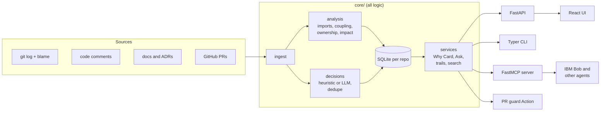

# Heirloom

**Heirloom tells you why code is the way it is, who still understands it, and what breaks if you change it, so knowledge does not leave when an engineer does.**

It mines a repository's git history, blame, code comments, pull requests and docs into a decision graph. People use it through a web UI and a CLI. AI coding agents (IBM Bob first, then any MCP client) use it through an MCP server, so they read a file's history before they edit it and record new decisions after.

Measured on [pallets/click](https://github.com/pallets/click): Heirloom ingested **2,000 commits in 22 seconds** (clone included, no LLM), found **854 decisions**, and showed that **41.7% of click's 31,919 lines have a bus factor of 1**, with **18 files at risk**.

## Features

| | |
|---|---|
| **Why Card** | One page per file: what it does, the decisions behind it with evidence links, who knows it, what breaks if it changes, DO NOT / HACK warnings, and a commit timeline. Copy it as Markdown or as compact agent context. |
| **Bus Factor Map** | A treemap of the repo sized by lines and colored by bus factor, with at-risk files striped. The "If this person left" filter shows one person's footprint. Exports to PNG. |
| **Onboarding Trails** | An ordered reading path, general or by topic, that puts dependencies first. Progress is saved in the browser and the trail exports to Markdown. |
| **Ask Heirloom** | Questions answered only from recorded decisions, with citations. Without an LLM it returns ranked, cited decisions. |
| **Decision capture** | Record decisions from the web form, `heirloom decide`, or the MCP tool `record_decision`. Each one is saved as Markdown in `.heirloom/decisions/`, so it lives in git. |
| **PR guard** | A GitHub Action that comments on each PR with the decisions it may conflict with, bus factor, impacted files outside the PR, and DO NOT comments near changed lines. It updates one comment in place and works on forks with no secrets. |
| **MCP server** | Seven tools for agents: `ask_why`, `who_knows`, `impact_if_changed`, `onboarding_trail`, `search_decisions`, `record_decision`, `repo_risk_report`. |

Everything works offline with zero API keys. Every feature that can use an LLM has a deterministic fallback, and the UI shows "unknown" rather than inventing a value.

## Quick start

Requires Python 3.11+, git, Node 20+ and pnpm.

```bash
git clone https://github.com/harshbpathak/Heirloom.git && cd Heirloom
python -m venv .venv
.venv/Scripts/pip install -e ".[dev]"      # macOS/Linux: .venv/bin/pip install -e ".[dev]"
cd web && pnpm install && pnpm build && cd ..

heirloom ingest https://github.com/pallets/click   # or a local path
heirloom serve                                     # UI and API on http://localhost:8000
```

### Without keys (default)

Nothing to configure. Decisions come from the heuristic extractor, summaries from header comments, and Ask returns ranked, cited decisions.

### With keys (optional)

Copy `.env.example` to `.env` and fill in what you have:

- `WATSONX_API_KEY`, `WATSONX_PROJECT_ID` (and optionally `WATSONX_MODEL_ID`) turn on IBM watsonx.ai Granite for decision extraction, file summaries, trail reasons and Ask answers. Install the SDK with `pip install -e ".[watsonx]"`.
- `LLM_BASE_URL`, `LLM_API_KEY`, `LLM_MODEL` use any OpenAI-compatible endpoint instead.
- `GITHUB_TOKEN` adds merged pull requests as evidence.

LLM responses are cached in SQLite, so re-runs cost nothing.

### Demo mode

`HEIRLOOM_DEMO=1` makes the app read-only: it loads existing snapshots and never calls the network.

## CLI

```text
heirloom ingest <path-or-github-url> [--since DATE] [--max-commits N]
heirloom why <file>                 # the Why Card in the terminal
heirloom who <file-or-dir>          # knowledge holders and bus factor
heirloom impact <file>              # impact set with reasons
heirloom trail [--topic TEXT]       # onboarding trail
heirloom ask "<question>"
heirloom decide "<title>" --files a.py b.py --why "..." [--alternatives "..."]
heirloom risk                       # repo-wide at-risk report
heirloom serve [--port 8000]        # API and web UI
heirloom mcp [--http --port 8765]   # MCP server (stdio by default)
heirloom export --format md|json
```

Every command accepts `--repo <id-or-path>` and `--json`. Full reference: [docs/cli.md](docs/cli.md).

## MCP setup

```json
{ "mcpServers": { "heirloom": { "command": "heirloom", "args": ["mcp"] } } }
```

Run `heirloom ingest .` in your project first. The server picks the repo from `HEIRLOOM_REPO`, then from its working directory. Tool reference and configs for IBM Bob, Claude Desktop, Cursor and VS Code: [docs/mcp.md](docs/mcp.md).

## IBM Bob

This repo ships a Bob custom mode and two skills:

- **Archivist** (`.bob/custom_modes.yaml`): a coding mode that never edits blind. It calls `ask_why` and `impact_if_changed` before each edit, stops when a change contradicts a recorded decision, and calls `record_decision` after real design choices.
- **capture-why** (`.bob/skills/capture-why/`): turns the staged diff into a decision record and stamps it with the SHA-256 of its own `SKILL.md`.
- **onboard-me** (`.bob/skills/onboard-me/`): walks a newcomer through the first three steps of an onboarding trail.

`.bob/mcp.json` registers the Heirloom MCP server for Bob. Details: [docs/BOB.md](docs/BOB.md).

## Architecture



The API, CLI and MCP server are thin layers over `core/`; no logic is duplicated. Scoring formulas and the data model: [docs/architecture.md](docs/architecture.md). REST endpoints: [docs/api.md](docs/api.md), with the OpenAPI spec served at `/api/openapi.json` and interactive docs at `/api/docs`.

## Tech stack

- **Backend:** Python 3.11+, FastAPI, SQLAlchemy 2, Alembic, Pydantic v2, GitPython and direct git calls, rapidfuzz, rank_bm25, Typer, rich, httpx, FastMCP, structlog
- **LLM:** IBM watsonx.ai (Granite) behind an `LLMProvider` interface, with an OpenAI-compatible provider and a no-key fallback
- **Frontend:** React 18, TypeScript (strict), Vite, Tailwind CSS, D3 v7, React Router, TanStack Query
- **Quality:** pytest (155 tests, 87% coverage on `core/`), Vitest and Testing Library (9 tests), ruff, mypy strict on `core/`, ESLint

## Development

```bash
pytest -q                                  # Python tests (no network, no keys)
cd web && pnpm test && pnpm lint && pnpm build
ruff check core api cli mcp_server tests && ruff format --check core api cli mcp_server tests
mypy core
```

See [CONTRIBUTING.md](CONTRIBUTING.md) and [AGENTS.md](AGENTS.md).

## Deploying

The UI is static; the API is a Python process that needs `git` and a disk. Host them separately:

1. **API**: deploy the `Dockerfile` (a `render.yaml` is included for [Render](https://render.com/deploy); Railway and Fly work the same way). Set `CORS_ORIGINS` to your UI origin, or `*`.
2. **UI on Vercel**: import the repo with root directory `web`. Add the environment variable `VITE_API_URL=https://<your-api-host>` and redeploy. `web/vercel.json` rewrites every route to `index.html`.

If the UI shows a red "Backend not connected" banner, `VITE_API_URL` is unset or the API is down.

## License

MIT. See [LICENSE](LICENSE).
